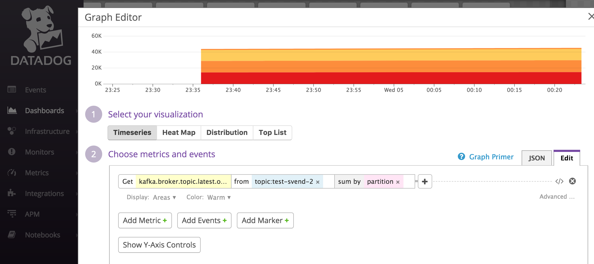

## Kafka topic latest offset datadog monitor

This simple python script polls the latest offset of all partitions of a set of Kafka topics and pushes the values as a gauge metric to Datadog via the Datadog agent.

This has been written against the following framework versions:

- kafka 0.10.2.1
- zookeeper 3.4.9
- Dogstatsd 5.11.3
- python 2.7


## Why monitoring the topic offset?

One crucial Kafka metric to monitor and set alert on is the **lag of each consumer**, i.e. how many un-consummed messages are present within the partions of the topics that consumer is reading. One quick and dirty way to measure it is simply to follow the [records-lag-max](http://docs.confluent.io/current/kafka/monitoring.html#fetch-metrics) MBean exposed by the Kafka consumer, although that is far from ideal, for the following reasons: 

- it only reports the largest lag among the partitions of that topic, so does not provide the whole picture
- it depends on the consumer itself to be both running and reachable, so that metric might become unavailable precisely when it's most needed, e.g. if a consumer is lagging due to some network partition or consumer crash 
- it's specific to the Java Consumer API 

The recommended way to monitor consumer lag (see "Kafka, the definitive guide, 1rst edition, chapter 10") is via some external process that tracks both the latest offsets produced to each partition and the latest offsets committed by a consumer, and compare that, for example partition by partition or by summing them. 

This scripts performs the first half of the story :) 

Keep in mind that a consumer can potentially consume from many topics, and that set of topics is not necessarily constant if the consumed topic names are specified with a regex. Also consumer imbalance can happen, so some partitions could be lagging due to some node overloading while others might be doing fine. 

## Do I really need this script to follow up the latest offsets?

NO!

Aha, silly me, after writting this I found out that Kafka brokers are exposing just the right MBean for that, named as follow:

```
kafka.log:type=Log,name=LogEndOffset,topic=TOPICNAME,partition=PARTITION_NUMBER
```

So the simplest way to follow that offset with DataDog is to use this kind of JMX integration:

```
   - include:
        domain: 'kafka.log'
        bean_regex: 'kafka.log:type=Log,name=LogStartOffset,topic=.*,partition=.*'
        attribute:
          Value:
            metric_type: gauge
            alias: kafka.server.topic.partition.log_offset.start
    - include:
        domain: 'kafka.log'
        bean_regex: 'kafka.log:type=Log,name=LogEndOffset,topic=.*,partition=.*'
        attribute:
          Value:
            metric_type: gauge
            alias: kafka.server.topic.partition.log_offset.end
```

Note also that LinkedIn's [Burrow](https://github.com/linkedin/Burrow) tool already provides Kafka consumer lag monitoring.


## How to use

... but if one really wants to use my script, here's how to do it :) 

You need to have a Datadog account to use this script. You also need to have the datadog agent running. 

See also [Datadog's getting started guide](http://docs.datadoghq.com/guides/basic_agent_usage/) for more info.

Setup dependencies:

```
pip install -r requirements.txt
```

Edit the [offset\_monitor\_config.py](./offset_monitor_config.py) config file

Make sure the datadog agent is up and running

Run the offset monitor:

```
# this process should be monitored by something like monit or so
python offset_monitor_config.py
```

Even if one instance of this process is enough to follow the offsets of all topics, feel free to start this on several nodes for higher metric availability. All instances will report the same values redundantly and Datadog will do just fine since it will simply have more datapoints to average in the gauge when displaying the time series. As the number of instances grow you might want to decrease the `poll_period_seconds` configuration parameter.

## Datadog metric

By default, this script produces metrics called `kafka.broker.topic.latest.offset` decorated with a `topic` and `partition` tag. 

The primary goal is to use it to compute consumers lag, although we can also directly visualize it in Datadog, simply by specifying the metric name, selecting the topic tag that match the topic we're interrested in, selecting "Area" kind of display and "sum by" partition tag. The result should somehow look as follows: 	



This graph quickly becomes un-interresting since as the offsets becomes very large, it tends to a set of flat line that do not provide much insight. 


 


